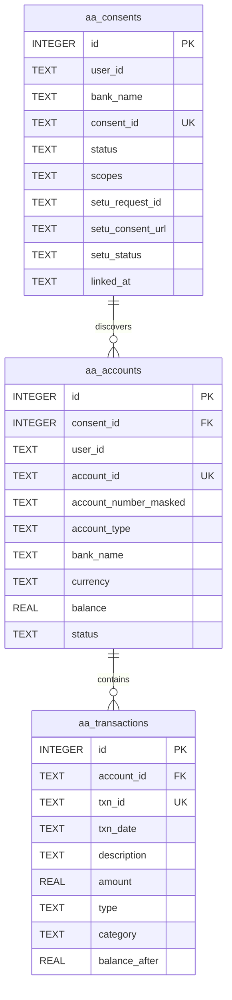

# Account Aggregator (AA) Architecture — PSB SecureWealth Twin

> Scope note: This document describes the **PSB-only AA flow** built for the SecureWealth Twin hackathon. It does not touch any other bank data or non-PSB modules in dsFinancial.

## 1. Purpose

The Account Aggregator integration lets a Punjab & Sind Bank customer consent to share their PSB account information with the SecureWealth Twin so the twin can build a unified net-worth and cash-flow view.

The implementation is **architecture-ready for SETU's real AA sandbox**. When `SETU_AA_CLIENT_ID`, `SETU_AA_CLIENT_SECRET` and `SETU_AA_PRODUCT_INSTANCE_ID` are configured, the backend creates consents on SETU's FIU sandbox. Without credentials it falls back to a deterministic mock flow so demos keep working.

## 2. Supported Institutions

For the demo, only one FIP is registered:

| FIP ID | Institution | Type | Scopes |
|---|---|---|---|
| `PSB-FIP-001` (configurable) | Punjab & Sind Bank | BANK | `profile`, `accounts`, `transactions`, `balance` |

In production, this FIP ID is replaced with PSB's real ID from the Sahamati FIP registry.

## 3. High-level Architecture

```text
┌─────────────────────────────────────────────────────────────────┐
│                     PSB SecureWealth Twin UI                    │
└───────────────────────┬─────────────────────────────────────────┘
                        │
                        ▼
┌─────────────────────────────────────────────────────────────────┐
│              Express API  /api/v1/aa/*                           │
│  • routes/aa.js          — consent, discover, fetch, revoke      │
│  • services/setuAaAdapter.js — SETU FIU API client               │
└───────────────────────┬─────────────────────────────────────────┘
                        │
        ┌───────────────┴───────────────┐
        │                               │
        ▼                               ▼
┌───────────────┐              ┌──────────────────────┐
│  SETU Sandbox │              │  Deterministic Mock  │
│  (when creds  │              │  (fallback)          │
│   present)    │              │                      │
└───────┬───────┘              └──────────────────────┘
        │
        ▼
┌─────────────────────────────────────────────────────────────────┐
│  AA Gateway  →  FIP (PSB)  →  consent / accounts / transactions │
└─────────────────────────────────────────────────────────────────┘
```

## 4. Internal API Flow

```text
Customer
   │
   ▼
GET  /api/v1/aa/institutions          → list supported FIPs (PSB only)
POST /api/v1/aa/consents              → create consent (SETU if configured; mock fallback on SETU errors)
GET  /api/v1/aa/consents/:id/status   → poll SETU consent status
POST /api/v1/aa/consents/:id/discover → discover accounts after approval
GET  /api/v1/aa/accounts              → list discovered accounts
GET  /api/v1/aa/accounts/:id/transactions → fetch transactions
POST /api/v1/aa/sync                  → one-shot discover + fetch all
DELETE /api/v1/aa/consents/:id        → revoke consent
GET  /api/v1/aa/callback              → SETU redirect URL after consent approval/rejection
POST /api/v1/aa/notifications         → SETU async webhook (configure in Bridge Step 1)
```

## 5. SETU Sandbox Flow

When credentials are present, the consent lifecycle talks to SETU:

```text
1. POST https://fiu-sandbox.setu.co/v2/consents
   Headers: x-client-id, x-client-secret, x-product-instance-id
   Body: consent object (vua, purpose, fiTypes, dataRange, frequency...)
   Response: { id, url, status: "PENDING" }

2. Redirect customer to consent url for approval.

3. SETU redirects the customer back to the configured redirect URL (e.g. `GET /api/v1/aa/callback?requestId=...`). The backend polls SETU for the latest status and then redirects to the frontend.

4. (Optional) SETU also sends asynchronous events to `POST /api/v1/aa/notifications` (consent approved/revoked, data ready, etc.).

5. Poll GET https://fiu-sandbox.setu.co/v2/consents/:id
   Status moves PENDING → ACTIVE/APPROVED

4. GET https://fiu-sandbox.setu.co/v2/consents/:id/data-sessions
   Lists data sessions created after account linking.

5. (Optional) GET https://fiu-sandbox.setu.co/v2/consents/:id/fetch/status
   Shows whether data has been fetched from the FIP.

6. (Optional) GET https://fiu-sandbox.setu.co/v2/sessions/:id/fetch
   Returns encrypted FI data.
   Decryption is done via Sahamati Rahasya (or Setu's managed decrypt helper).

7. POST https://fiu-sandbox.setu.co/v2/consents/:id/revoke
   Revokes consent on the AA side.
```

## 6. Data Model



## 7. Environment Variables

| Variable | Purpose | Example |
|---|---|---|
| `SETU_AA_BASE_URL` | SETU FIU base URL | `https://fiu-sandbox.setu.co` |
| `SETU_AA_CLIENT_ID` | FIU OAuth client ID | from Bridge |
| `SETU_AA_CLIENT_SECRET` | FIU OAuth client secret | from Bridge |
| `SETU_AA_PRODUCT_INSTANCE_ID` | Product instance ID | from Bridge |
| `SETU_AA_REDIRECT_URL` | Post-approval redirect | `https://your-app.com/aa/callback` |
| `SETU_PSB_FIP_ID` | PSB FIP identifier | `PSB-FIP-001` |

If any of `CLIENT_ID/SECRET/PRODUCT_INSTANCE_ID` is missing, the adapter returns an error and the route falls back to mock data.

## 8. Security & Privacy Guardrails

- Consent is created explicitly per institution.
- The UI must show a consent screen explaining which data is requested before calling `/consents`.
- Revoking consent via `DELETE /api/v1/aa/consents/:id` immediately marks the consent and all linked accounts as `revoked` and calls SETU's revoke endpoint when configured.
- No raw account numbers or UPI IDs are stored; only masked identifiers are persisted.
- SETU credentials are never logged or returned to the frontend.

## 9. Files

- `backend/routes/aa.js` — Express routes for consent/discover/fetch/revoke.
- `backend/services/setuAaAdapter.js` — SETU FIU API client with auth + error handling.
- `backend/services/database.js` — `aa_consents`, `aa_accounts`, `aa_transactions` persistence.
- `backend/.env.example` — required SETU environment variables.
- `MD/account-aggregator-architecture.md` — this document.

## 10. Production Migration Path

To go live:

1. Complete SETU FIU onboarding and Sahamati registration.
2. Replace `SETU_AA_BASE_URL` with `https://fiu.setu.co`.
3. Replace `SETU_PSB_FIP_ID` with PSB's real Sahamati FIP ID.
4. Configure a public webhook endpoint on the Bridge for consent/FIP notifications.
5. Implement Sahamati Rahasya decryption for `/v2/sessions/:id/fetch` responses.
6. Remove the deterministic mock fallback or gate it behind an explicit demo flag.
