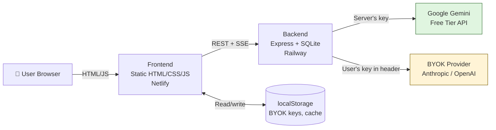

# dsFinancial — Phase 2 v2 Upgrade Prompt
## Portfolio Edition · Free AI · BYOK Fallback

**Paste this entire document into Claude Code / Cursor / your AI coding tool as the system + task brief.**

---

## 0. Context for the AI Assistant Reading This

You are upgrading an existing financial modeling web app called **dsFinancial**. This document **supersedes** the previous Phase 2 prompt — the project has pivoted.

### What changed since Phase 2 v1

- **End goal is now a portfolio project**, not a SaaS. The owner (Ira, MSc Corporate Finance student at the University of Galway) will use this to demonstrate technical and finance skills to recruiters at investment banks, equity research firms, asset managers, and fintechs.
- **No paid AI API.** No Anthropic credit card. No Claude API key. Free tier AI only.
- **Primary AI:** Google Gemini free tier (no credit card required).
- **Fallback:** "Bring Your Own Key" (BYOK) — users with their own Anthropic, OpenAI, or Gemini paid keys can paste them into the app for unlimited use. Keys live in the browser only, never on the server.
- **Existing backend:** Express + SQLite at `E:\DS_Financial\backend\`. **Keep it.** Augment, don't rewrite.

### Current code state

- Static frontend on Surge: `index.html`, `financial-modelling.html`. Branding done.
- Backend: Express + better-sqlite3 with working auth, JWT, rate limits, Helmet, CORS, 8 passing tests, Docker.
- Modules with UI tabs already built: DCF, Comps, IS/BS/CF, LBO, M&A, Sensitivity, WACC, Monte Carlo, Earnings Forecast.
- India-first defaults: tax 25.17% (Sec 115BAA), Reliance sample data, INR.
- Tutor Mode v1: static slide-out panel with Damodaran / McKinsey / Ross-Westerfield / Rosenbaum & Pearl references.

### Your mission

Turn dsFinancial into a **portfolio-grade, AI-powered, completely free** financial modeling tool that a recruiter can demo in 5 minutes and want to hire you over.

---

## 1. Phase 2 v2 Goals (Non-Negotiable)

By the end of this phase:

1. **PDF Extraction works** — drop an annual report, get a populated three-statement model in <90s, powered by Gemini's native PDF understanding.
2. **AI Chat panel works** — persistent right-rail chat, streaming responses, scoped to the active model.
3. **Contextual Tutor Mode v2** — hover any cell with Tutor Mode on, get a 4-section explanation in a tooltip.
4. **Provenance tagging** — every cell shows where its value came from: manual / extracted / AI-suggested / formula.
5. **BYOK flow works** — a clean settings panel where users can paste their Anthropic/OpenAI/Gemini key and choose their model.
6. **Public model gallery** — 3 pre-built models (Reliance, TCS, Infosys) viewable by anyone without an account, for recruiter demos.
7. **GitHub repo and case study are publication-ready** — clean README with screenshots, architecture diagram, live demo URL, 2-minute Loom video link.

Goals 6 and 7 are **portfolio-mode-specific** and equally important to the AI features. Treat them as first-class deliverables, not afterthoughts.

---

## 2. Architecture Decisions

### 2.1 Stack — Confirmed

| Layer | Tool | Rationale |
|---|---|---|
| Frontend | Existing static HTML/CSS/JS on Surge | Keep. Augment with new UI panels. Phase 3 may migrate to Next.js. |
| Backend | Existing Express + better-sqlite3 | Keep. Augment with new routes/services. |
| AI (default) | **Gemini 2.5 Flash** (extraction) + **Gemini 2.5 Flash-Lite** (chat/tutor) | Free tier, no credit card. Native PDF support up to ~1000 pages. |
| AI (BYOK) | Anthropic / OpenAI / Gemini paid | User pastes key in browser, stored in localStorage only |
| PDF parsing | **Gemini native PDF input** (primary) + `pdf-parse` (fallback for text-only) | Gemini handles PDFs as a native input type — no separate OCR pipeline needed |
| File storage | **Local filesystem** (`/uploads` dir) on the deployment host | No object store needed; deploy to host with persistent disk |
| Deployment | **Railway** free tier (or Render with attached disk) | Both have persistent disk, no execution timeouts (vs Vercel's 300s cap), generous free tier for a portfolio piece |
| Frontend hosting | Existing **Surge** | Or migrate to Vercel/Netlify for custom domain + better CI |
| DB | **SQLite** (existing) | Fine for portfolio scale. Add `ai_runs` and `extractions` tables. |
| Logging | Pino → stdout (Railway captures it) | Cheap, structured |
| Monitoring | None required for portfolio | Optional: PostHog free tier for usage stats to show "real users" in case study |

### 2.2 AI Provider Architecture (Critical)

This is the architectural keystone of v2. Build it right and BYOK is trivial.

Create `backend/services/ai-provider.js` as a **pluggable adapter**:

```js
// services/ai-provider.js
const adapters = {
  gemini: require("./adapters/gemini-adapter"),
  anthropic: require("./adapters/anthropic-adapter"),
  openai: require("./adapters/openai-adapter"),
};

const TASK_DEFAULTS = {
  extract: { provider: "gemini", model: "gemini-2.5-flash" },
  chat: { provider: "gemini", model: "gemini-2.5-flash-lite" },
  explain: { provider: "gemini", model: "gemini-2.5-flash-lite" },
  memo: { provider: "gemini", model: "gemini-2.5-flash" },
};

async function callAI(task, opts) {
  // 1. Determine provider: use opts.userApiKey config if BYOK, else server default
  // 2. Pick the adapter
  // 3. Log to ai_runs (always)
  // 4. Handle 429 with exponential backoff (Gemini free tier hits this often)
  // 5. Return normalized response shape regardless of provider
}

module.exports = { callAI };
```

**Each adapter implements the same interface:**
```js
{ extract({ pdfBuffer, prompt }), chat({ messages, system, stream }), explain({ cell, context }) }
```

This means the route handlers never know which provider they're using. Adding Claude or OpenAI later = one new adapter file.

### 2.3 BYOK Storage (Critical Security)

User-supplied API keys live in the **browser only**:

- Stored in `localStorage` under key `dsf_byok_keys` as `{ anthropic, openai, gemini }`.
- Sent with each API request in a custom header: `X-BYOK-Key: <provider>:<key>` (HTTPS only).
- Backend reads the header, uses it for the AI call, **never logs it**, **never persists it**.
- Backend startup must include an assertion: `if (LOG_RAW_HEADERS) crash()` — no debug toggles that print BYOK keys.
- The Settings UI must include: *"Your API key never leaves your browser except to make the AI call you requested. Source code: <github link>."*

This is non-negotiable. Trust is the entire BYOK proposition.

### 2.4 Free-Tier Quota Management

Server's Gemini key has **hard daily limits**:
- 250 RPD on Gemini 2.5 Flash
- 1,000 RPD on Gemini 2.5 Flash-Lite
- 100 RPD on Gemini 2.5 Pro

Implement a global counter in SQLite (`server_quota` table, reset at midnight Pacific). When 80% consumed, the UI shows a soft warning: *"Shared AI quota is running low today. Add your own free Gemini key (takes 2 minutes) for unlimited usage."* When 100% consumed, return `429` with a friendly upgrade prompt — never silently fail.

Per-device-id soft limits (to prevent one user burning the shared quota):
- PDF extractions: 2/day
- AI chat messages: 20/day
- Cell explanations: 100/day

These are softer than the server cap so the *user* hits their limit before the *server* does.

---

## 3. Build Modules (In Order)

### Module 1 — AI Provider Layer

**Files to create:**
```
backend/
├── services/
│   ├── ai-provider.js                # Dispatcher
│   └── adapters/
│       ├── gemini-adapter.js         # Gemini SDK or REST
│       ├── anthropic-adapter.js      # Anthropic SDK (BYOK only)
│       └── openai-adapter.js         # OpenAI SDK (BYOK only)
├── routes/
│   └── ai-test.js                    # POST /api/v1/ai/test — diagnostic endpoint
└── tests/
    └── ai-provider.test.js
```

**Gemini SDK:** `@google/generative-ai` (npm). Use the official SDK; it handles streaming and PDF input natively.

**Acceptance:** `POST /api/v1/ai/test` with `{ task: "chat", message: "Hello" }` returns a Gemini response. Token usage logged to `ai_runs`. Test with mocked adapter passes without an API key set.

### Module 2 — Provenance & Model State Refactor

Same as Phase 2 v1 Module 6. The canonical `FinancialModel` JSON schema (defined in Appendix B of the previous prompt) is the source of truth. Every value is `{ value, unit, provenance, last_updated }`.

This must be done **before** Modules 3-5; they depend on it.

**Acceptance:** `window.__model` returns a valid `FinancialModel` JSON with every cell carrying provenance. Saving to backend + refreshing restores the model exactly.

### Module 3 — PDF Extraction (Killer Feature)

**Endpoint:** `POST /api/v1/extract/pdf`

**Flow:**
1. Accept multipart upload (max 50MB, ≤500 pages).
2. Save to `uploads/{deviceId}/{uuid}.pdf` and compute SHA-256 hash.
3. Check `extractions` table for cached result by hash. If present <30 days old, return it.
4. Pass the PDF directly to Gemini via the SDK's `fileManager` upload + `generateContent` with the PDF as an inline file part. **Gemini understands PDFs natively** — no need for pdf-parse text extraction in the primary path.
5. System prompt: see Appendix A. Force JSON response.
6. Parse + Zod-validate the response.
7. Save to `extractions` table. Return JSON to frontend.

**Frontend wiring:**
- Drag-drop zone at sidebar top.
- Progress indicator: "Reading filing... (Gemini typically takes 30-90s for a 200-page report)".
- Review UI: PDF preview left, parsed table right, confidence chips per row, source-page indicators.
- "Confirm & Load" button → values flow into `FinancialModel` with provenance `{ type: "extracted", source_pdf_id, page, confidence }`.

**Acceptance:** Upload Reliance Industries' actual FY24 Annual Report (download from `ril.com`). Within 90 seconds, see 3 years of IS/BS/CF populated. Overall confidence ≥ 85% (Gemini Flash is slightly behind Claude Opus on this task — adjust threshold accordingly).

### Module 4 — AI Chat Panel

**Endpoint:** `POST /api/v1/ai/chat` (server-sent events for streaming)

Request:
```json
{
  "model_id": "uuid",
  "model_snapshot": { /* truncated FinancialModel */ },
  "conversation_history": [...],
  "user_message": "..."
}
```

System prompt: Appendix B of the previous prompt, but adapt the tone to Gemini (it's slightly more verbose by default — instruct it to be concise).

Stream via Gemini's `streamGenerateContent` method.

**Frontend:** Right-rail slide-out, streaming token rendering, clickable cell citations (`[cell:line_item_id]`), localStorage-persisted conversation history per model.

**Acceptance:** Same as Phase 2 v1 — accurate numeric answers, conversation persists across tabs, citations scroll to cells.

### Module 5 — Contextual Tutor Mode v2

**Endpoint:** `POST /api/v1/ai/explain-cell` (JSON response, not streamed)

Request/response shape: same as Phase 2 v1 Appendix E.

**Critical:** Aggressive cache. Hash `(cell_id, value, formula)` → response in localStorage for 7 days. Most cells will be cache hits after the first visit, which keeps the server quota intact.

**Frontend:** Hover 500ms with Tutor Mode on → tooltip with loading skeleton → 4-section explanation.

**Acceptance:** Same as Phase 2 v1.

### Module 6 — BYOK Settings UI

**Files (frontend):**
- New page or modal: `settings.html` (or modal in `financial-modelling.html`)
- Three input fields (Anthropic, OpenAI, Gemini) with masked display, "Test" buttons, save to `localStorage`
- Provider selector: "Use server's free Gemini" (default) / "Use my own key"
- Per-task model override (advanced users): "Use Claude Opus for extraction" etc.

**Backend changes:**
- Every AI route reads `X-BYOK-Key` header. If present, override the default provider for that call.
- Add a `/api/v1/ai/test-key` endpoint that proxies a tiny test call to the user's key and returns success/failure (so the "Test" button works).

**Acceptance:** User pastes a valid Anthropic key, clicks Test, sees ✓. From then on, all their AI calls go through Claude. No rate limiting from the shared Gemini quota.

### Module 7 — Public Model Gallery (Portfolio-Critical)

This is what recruiters will click first. Make it shine.

**Backend:**
- `GET /api/v1/gallery` — returns 3 curated models: Reliance Industries, TCS, Infosys.
- Each is a fully-built `FinancialModel` JSON, generated **once by you** (run extraction on each, polish manually, commit the JSON to the repo at `backend/seeds/gallery/`).
- `GET /api/v1/gallery/:slug` returns one full model. No auth.

**Frontend:**
- New page: `gallery.html` (or anchor on home page).
- Three large cards: Reliance, TCS, Infosys. Each shows: company name, current intrinsic value vs market price, implied upside/downside, last-updated date.
- Click → opens read-only version of `financial-modelling.html` with that model loaded. Chat panel is **enabled** so recruiters can ask the AI questions immediately.
- Big banner: *"This is a portfolio project by Ira [name]. Want to know how it was built? [GitHub] [Case Study] [Email]"*

**Acceptance:** Recruiter visits the gallery URL on mobile, taps Reliance, sees a clean dashboard, asks the AI "What's driving the valuation?", gets an answer. Total time-to-wow: <30 seconds.

---

## 4. Portfolio-Specific Deliverables (NEW)

These are not engineering tickets — they are deliverables for the recruiter narrative.

### 4.1 GitHub Repository

- Make `dsfinancial` public on GitHub once the AI layer works.
- README must include, in this order:
  1. **One-liner** — what it is, who it's for, live demo link.
  2. **Screenshot** of the gallery / a populated model (animated GIF preferred).
  3. **Try it now** — 2-step instructions to demo it locally or visit live.
  4. **What it does** — 4-5 bullets, finance-recruiter-readable.
  5. **Architecture** — one diagram (Mermaid), one paragraph.
  6. **AI stack** — Gemini free tier + BYOK, why this approach.
  7. **Tech stack** — list.
  8. **Built by Ira** — link to LinkedIn, case study, contact.
- License: MIT.
- `.env.example` with placeholders, never the real key.

### 4.2 Case Study / Writeup

A single Notion page or Medium post titled something like *"How I built an AI-powered financial modeling tool as an MSc Finance student."* Sections:

1. **The problem** — 2 paragraphs on the gap between Capital IQ ($30K/yr) and Excel templates.
2. **The build** — 3-4 paragraphs on the modules, with screenshots.
3. **The AI choices** — why Gemini, why BYOK, what was hard.
4. **Numbers** — extraction speed, accuracy on test set of 5 real Indian annual reports, daily AI cost (₹0).
5. **What's next** — Phase 3 roadmap.
6. **What I learned** — finance + engineering + product, 3 bullets each.

Aim for 1,500 words. Recruiters skim — front-load the screenshots and numbers.

### 4.3 Demo Video

2-minute Loom or screen recording. Script:
- 0:00-0:15 — Intro: name, school, what dsFinancial is.
- 0:15-0:45 — Drag-drop a Reliance PDF, show extraction.
- 0:45-1:15 — Show DCF, change WACC, ask AI "How did that change EV?"
- 1:15-1:45 — Show Tutor Mode hover on FCFF.
- 1:45-2:00 — Mention GitHub, BYOK, invite to connect.

Link from README + case study + LinkedIn.

### 4.4 LinkedIn Post

When everything is live, post: image of the gallery + 3-paragraph caption + GitHub link + case study link. Tag the relevant finance + Indian fintech communities.

---

## 5. Privacy, Trust & Disclaimers

### 5.1 Required disclosures (visible footer on every page)

- *"dsFinancial is an educational and analytical tool. Not investment advice."*
- *"When using the free Gemini AI tier, Google may use your inputs to improve their models. Add your own paid API key in Settings for full privacy."*
- *"All financial models and uploaded PDFs are stored on this device unless you choose to share them."*

### 5.2 BYOK trust footer (Settings page)

- *"Your API keys are stored only in your browser's localStorage. They are sent only when you make an AI call, and only to the provider you selected (Anthropic / OpenAI / Google). They are never logged or persisted on dsFinancial's servers. Verify it yourself: [link to GitHub source]."*

### 5.3 Data deletion

`Settings → Delete all my data` button: clears `localStorage`, calls `DELETE /api/v1/user/me` which wipes the device's models, uploads, and audit entries.

---

## 6. Deployment

### 6.1 Recommended setup

- **Backend:** Railway (free tier; persistent disk; no execution timeout). Deploy from the existing `dsfinancial-backend` repo. Add `ANTHROPIC_API_KEY` env var only if you want server-side Claude later. For Phase 2 v2, only `GEMINI_API_KEY` is required.
- **Frontend:** Stay on Surge for now, or migrate to **Netlify/Vercel** for free custom domain + automatic deploys from GitHub. Custom domain `dsfinancial.in` (cheap on Namecheap, ₹600/yr) makes the portfolio piece feel real.
- **Custom domain:** Strongly recommended. `dsfinancial.in` or `dsfinancial.app` for resume signal.

### 6.2 CI/CD

- GitHub Actions: on push to `main`, run tests, deploy backend to Railway, deploy frontend to Netlify.
- Health check at `/api/v1/health` runs every 5 minutes (UptimeRobot free tier). If the demo URL is down when a recruiter visits, you've wasted the opportunity.

### 6.3 Cost summary (ongoing)

| Item | Cost |
|---|---|
| Railway free tier | ₹0 |
| Netlify free tier | ₹0 |
| Gemini API free tier | ₹0 |
| Custom domain (optional) | ~₹600/year |
| **Total** | **₹0–₹50/month** |

This stays free indefinitely for a portfolio piece serving <500 daily AI requests.

---

## 7. Recruiter Demo Script (Acceptance Criteria)

The phase is done when a recruiter who has never seen the project can, in ≤5 minutes, do this:

1. Visit `https://dsfinancial.in` (or whichever URL).
2. Tap "View Gallery" → tap "Reliance Industries".
3. Within 2 seconds, see a populated DCF / Comps / IS-BS-CF dashboard with valuation summary.
4. Hover the "Terminal Value" cell with Tutor Mode on → see a 4-section AI-generated explanation citing Damodaran.
5. Open the AI Chat panel → ask *"Which assumption is the valuation most sensitive to?"* → get a streamed, cited answer in <10 seconds.
6. (Optional but ideal) Tap "Upload Your Own" → drop any annual report PDF → watch it parse → see the model populate.
7. Tap "How was this built?" → land on the case study.
8. Tap "View Code" → land on the public GitHub.

If all 8 steps work flawlessly on first try, on a mid-range Android in a coffee shop wifi, you ship.

---

## 8. Out of Scope (Phase 3+)

Do not work on these. They are explicitly deferred.

- User accounts / authentication beyond device_id.
- Billing (none needed; portfolio piece is free forever).
- Excel export (nice to have, but won't move the recruiter needle in Phase 2 v2 — push to Phase 3).
- Monte Carlo simulation.
- LBO/M&A AI features (the modules exist with manual entry; AI on them is Phase 3).
- Mobile app.
- Multi-language support.
- Migration to Next.js.

---

## 9. Implementation Order (4-week sprint)

| Week | Deliverable |
|---|---|
| **Week 1** | Module 1 (AI provider + Gemini adapter) + Module 2 (provenance refactor) |
| **Week 2** | Module 3 (PDF extraction) + Module 5 (cell explanations) |
| **Week 3** | Module 4 (chat panel) + Module 6 (BYOK settings) |
| **Week 4** | Module 7 (gallery) + portfolio deliverables (§4) + deployment + recruiter demo testing |

If Week 4 deliverables (gallery + case study + video) aren't done, **delay the launch**. Code without packaging is not a portfolio piece.

---

# Appendix A — Gemini Extraction System Prompt

```
You are a financial data extraction engine. You will receive an annual report or 10-K filing as a PDF.

Extract the consolidated Income Statement, Balance Sheet, and Cash Flow Statement for the last 3 reported fiscal years.

Return STRICT JSON matching the schema below. No preamble. No markdown fences. JSON only.

{
  "company": {
    "name": "string",
    "ticker": "string or null",
    "currency": "INR|USD|EUR|GBP",
    "fiscal_year_end": "string (e.g. 'March 31')",
    "accounting_standard": "IND_AS|IFRS|US_GAAP"
  },
  "statements": {
    "income_statement": {
      "FY24": [
        {"label": "Revenue from operations", "value": 902064, "unit": "INR_CR", "source_page": 142, "confidence": 0.98}
      ],
      "FY23": [...],
      "FY22": [...]
    },
    "balance_sheet": { /* same shape */ },
    "cash_flow": { /* same shape */ }
  },
  "overall_confidence": 0.0,
  "warnings": [
    {"line_item": "...", "issue": "...", "page": 0}
  ]
}

ABSOLUTE RULES:
1. NEVER fabricate numbers. If unclear, set value to null and add a warning.
2. NEVER estimate or interpolate.
3. Prefer Consolidated over Standalone statements.
4. Use the unit the company reports in (typically INR_CR for Indian filings, USD_MN for US).
5. source_page is 1-indexed.
6. Map common label variants to canonical names:
   - "Revenue from operations" / "Total income" / "Net sales" → use as-is, do not rename
   - Preserve the company's wording in label, but be consistent within the response
7. Lower confidence (< 0.9) for any value where:
   - Page layout was complex (notes mixed with statement)
   - Multiple plausible values for the same line item
   - OCR-ish ambiguity
```

---

# Appendix B — Gemini Chat System Prompt

```
You are a senior equity analyst tutoring an MSc Finance student. The user's current financial model is provided below as JSON inside <model> tags. Answer their questions using:

1. The data in the model (cite specific cells with [cell:line_item_id] markers)
2. Standard finance theory (Damodaran, McKinsey Valuation, Ross-Westerfield)
3. Indian Ind-AS context when relevant (default tax 25.17%, INR ₹ crore notation)

RULES:
- Be concise: 3-6 sentences per answer.
- Intuition first, then numbers, then theory.
- If data isn't in the model, say so. Don't guess.
- Never recommend buy/sell — this is educational, not advisory.
- Reference cells as [cell:dcf.fcff.fy26] etc. The UI will make these clickable.

<model>
{INSERT_MODEL_JSON_HERE}
</model>
```

---

# Appendix C — Gemini Adapter Implementation Sketch

```js
// services/adapters/gemini-adapter.js
const { GoogleGenerativeAI } = require("@google/generative-ai");
const { GoogleAIFileManager } = require("@google/generative-ai/server");

const genAI = new GoogleGenerativeAI(process.env.GEMINI_API_KEY);
const fileManager = new GoogleAIFileManager(process.env.GEMINI_API_KEY);

async function extract({ pdfBuffer, prompt, model = "gemini-2.5-flash" }) {
  // 1. Upload PDF
  const file = await fileManager.uploadFile(pdfBuffer, {
    mimeType: "application/pdf",
    displayName: "filing.pdf",
  });

  // 2. Generate
  const generativeModel = genAI.getGenerativeModel({ model });
  const result = await generativeModel.generateContent([
    { fileData: { mimeType: "application/pdf", fileUri: file.file.uri } },
    prompt,
  ]);

  // 3. Parse + return
  const text = result.response.text();
  const json = JSON.parse(text);
  return { json, usage: result.response.usageMetadata };
}

async function chat({ messages, system, model = "gemini-2.5-flash-lite", stream = true }) {
  const generativeModel = genAI.getGenerativeModel({
    model,
    systemInstruction: system,
  });
  const chatSession = generativeModel.startChat({
    history: messages.slice(0, -1).map((m) => ({
      role: m.role === "assistant" ? "model" : "user",
      parts: [{ text: m.content }],
    })),
  });
  const lastMessage = messages[messages.length - 1].content;
  return stream
    ? chatSession.sendMessageStream(lastMessage)
    : chatSession.sendMessage(lastMessage);
}

module.exports = { extract, chat };
```

---

# Appendix D — BYOK UI Mockup (Settings Page)

```
┌────────────────────────────────────────────────────┐
│  Settings → AI Configuration                       │
├────────────────────────────────────────────────────┤
│                                                    │
│  ● Use the shared Gemini free tier (default)       │
│      Best for: trying it out, light usage          │
│      Limits: 250 PDF extractions/day, shared       │
│                                                    │
│  ○ Use my own API key (unlimited)                  │
│                                                    │
│      ┌────────────────────────────────────────┐   │
│      │ Anthropic (Claude)  [Best quality]    │   │
│      │ sk-ant-•••••••••••  [Test] [Save]      │   │
│      │ Get a key: console.anthropic.com       │   │
│      └────────────────────────────────────────┘   │
│      ┌────────────────────────────────────────┐   │
│      │ OpenAI (GPT-4o)                        │   │
│      │ sk-•••••••••••••••• [Test] [Save]      │   │
│      └────────────────────────────────────────┘   │
│      ┌────────────────────────────────────────┐   │
│      │ Google (Gemini paid tier)              │   │
│      │ ••••••••••••••••••• [Test] [Save]      │   │
│      └────────────────────────────────────────┘   │
│                                                    │
│  🔒 Your keys live in this browser only. They are  │
│     never sent to dsFinancial's servers. They are  │
│     sent directly to the AI provider when you ask  │
│     a question. [View source code on GitHub]       │
│                                                    │
│  [Delete all my data]   [Export my models]         │
└────────────────────────────────────────────────────┘
```

---

# Appendix E — README Skeleton

```markdown
# dsFinancial

> AI-powered financial modeling for finance students. Free forever. India-first, globally usable.

🔗 **Live demo:** https://dsfinancial.in
🎥 **2-min video:** [Loom link]
📖 **Case study:** [Notion / Medium link]


## What it does

- Drag-drop any annual report PDF → get a populated 3-statement model in 60 seconds
- DCF, Comps, LBO, M&A, WACC, Sensitivity — all interactive, all explained
- Ask the AI questions about your model — context-aware, cited answers
- Tutor Mode: hover any cell, get a textbook-grade explanation
- Free for users (Gemini free tier) or bring your own API key for unlimited use

## Try it

- **Online:** https://dsfinancial.in/gallery (no signup)
- **Local:** `git clone && npm install && npm run dev`

## Architecture

[Mermaid diagram here]

Frontend: vanilla HTML/CSS/JS on Netlify
Backend: Express + SQLite on Railway
AI: Google Gemini (free tier) + BYOK fallback for Anthropic/OpenAI

## Built by

[Ira] — MSc Corporate Finance, University of Galway
[LinkedIn] · [Email] · [Portfolio]
```

---

# Appendix F — Mermaid Architecture Diagram



---

## End of Prompt

When you (the AI coding assistant) start, your first message back should:
1. Confirm understanding of the portfolio-mode pivot and the Gemini-default / BYOK-fallback architecture.
2. List any clarifications needed.
3. Propose the exact first PR — start with **Module 1 (AI provider) + Module 2 (provenance refactor)** in parallel, since everything depends on them.

Build one module at a time. Get acceptance before moving on. Ship Week 4's portfolio deliverables (§4) with the same seriousness as the code.
