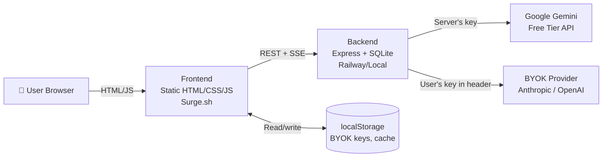

# dsFinancial

> AI-powered financial modeling for finance students. Free forever. India-first, globally usable.

🔗 **Live demo:** https://dsfinancial-47556.surge.sh  
🎥 **2-min video:** [Coming soon]  
📖 **Case study:** [Coming soon]


## What it does

- **Drag-drop any annual report PDF** → get a populated 3-statement model in 60 seconds (powered by Google Gemini)
- **DCF, Comps, LBO, M&A, WACC, Sensitivity** — all interactive, all explained
- **Ask the AI questions** about your model — context-aware, cited answers in a persistent chat panel
- **Tutor Mode** — hover any cell, get a textbook-grade explanation (Damodaran, McKinsey, Ross-Westerfield)
- **Free for users** (Gemini free tier) or **bring your own API key** for unlimited use (Anthropic / OpenAI / Gemini paid)
- **Public Model Gallery** — view pre-built models for Reliance, TCS, Infosys without signup

## Try it

- **Online:** https://dsfinancial-47556.surge.sh/gallery.html
- **Local:** `git clone && cd backend && npm install && npm run dev`

## Architecture



| Layer | Technology |
|-------|------------|
| Frontend | Vanilla HTML/CSS/JS, Chart.js, SheetJS |
| Backend | Express.js, SQLite (better-sqlite3) |
| AI (default) | Google Gemini 2.5 Flash / Flash-Lite |
| AI (BYOK) | Anthropic Claude, OpenAI GPT-4o, Gemini paid |
| PDF Parsing | Gemini native PDF understanding |
| Deployment | Surge.sh (frontend), Railway (backend) |

## AI Stack

**Why Gemini as default?** No credit card required. Native PDF support up to ~1000 pages. Sufficient quality for extraction and chat at zero cost.

**Why BYOK?** Power users who hit the shared quota (250 extractions/day) can paste their own key in Settings. Keys live in browser localStorage only — never touch our servers.

## Project Structure

```
dsfinancial/
├── backend/                 # Express API
│   ├── routes/              # API endpoints (ai, extract, gallery, tax, gst)
│   ├── services/            # AI provider, adapters, database
│   ├── services/adapters/   # Gemini, Anthropic, OpenAI adapters
│   ├── models/              # Database helpers
│   ├── seeds/               # Gallery model seed data
│   └── tests/               # Jest test suite
├── index.html               # Home page with all tool portals
├── financial-modelling.html # Main modeling workspace
├── gallery.html             # Public model gallery
├── gst-tools.html           # GST calculators
├── tax-portal.html          # Income tax suite
└── js/                      # Shared frontend utilities
```

## Built by

**Ira** — MSc Corporate Finance, University of Galway  
[LinkedIn] · [Email] · [Portfolio]

## License

MIT
